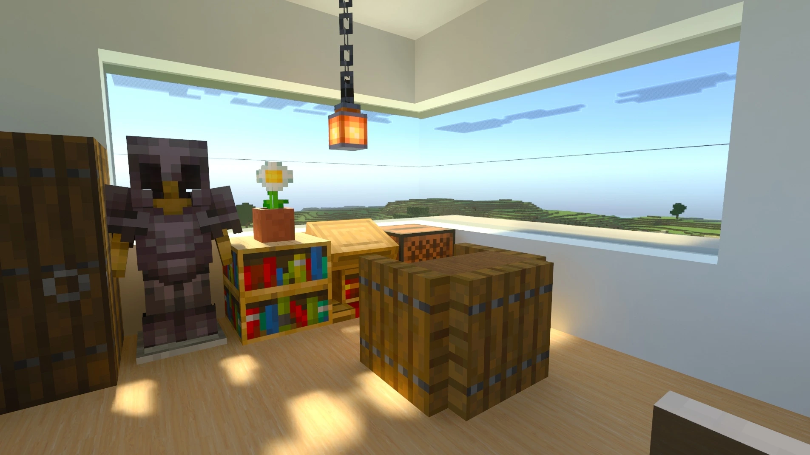
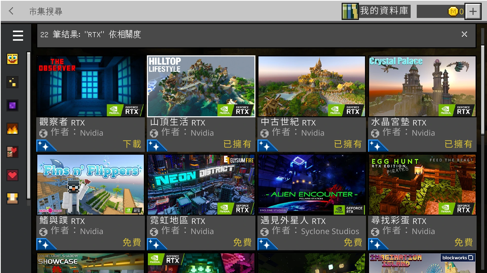
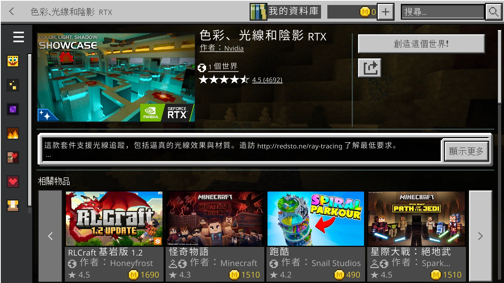
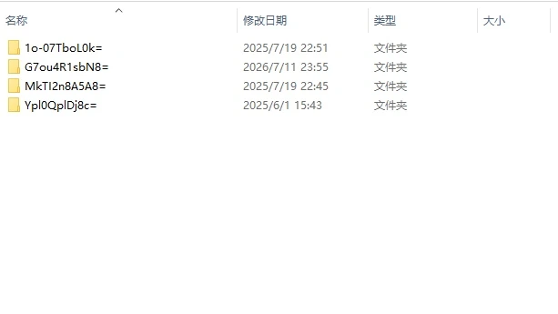
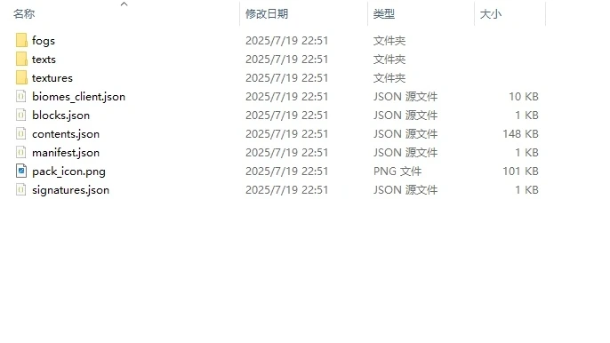
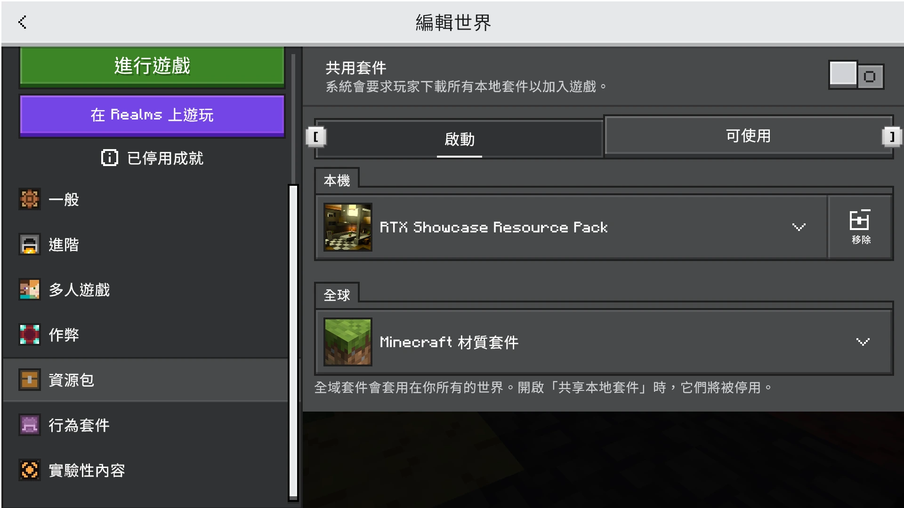

## 写在前面

之前微软为 Minecraft 基岩版添加了光线追踪，但不知什么原因，成了半成品，现在被灵动视效取代了😭。

我还是更喜欢光线追踪。光线追踪的配置其实挺麻烦的，所以在这里写个教程，做个备忘。

## 效果图

## 配置方法


游戏版本为 26.33，理论上支持光线追踪的版本（1.16.200 以后）均可用。基岩版更新十分频繁，如果该方法不可用，可以通过[电子邮件](mailto:Hydroxid_Hualin@outlook.com)联系我。


### 1. 下载官方模板

在商店中搜索 **RTX**，下载官方模板。

个人比较喜欢 Color, light and shadow RTX，偏现代一点。

### 2. 找到资源包

下载并创建世界后，打开 `C:\Users\你的用户名\AppData\Roaming\Minecraft Bedrock\premium_cache\world_templates\`

接着会有好几个乱码的文件夹。不必理会，打开后点一下里面的图片，就知道是什么模板了。

找到想要的模板文件夹，打开 `resource_packs\rp0`

你可能会看到类似这些文件：

全选，压缩为 `.zip` 格式。更改后缀名为 `.mcpack`。双击导入到 Minecraft。

### 3. 启用资源包

进入 Minecraft，找到想应用光追的世界，点击编辑世界，启用刚刚导入的资源包，像这样就可以了。

### 4. 启用光线追踪

进入世界，打开显示设置，选择画面为光线追踪。返回，完成！

## 总结

实际上，我们也可以改用第三方的资源包，这样更方便，双击导入就可以了。不过本人更喜欢官方的光追，所以就写了这么一篇操作方法。

享受 Minecraft 吧！

✨