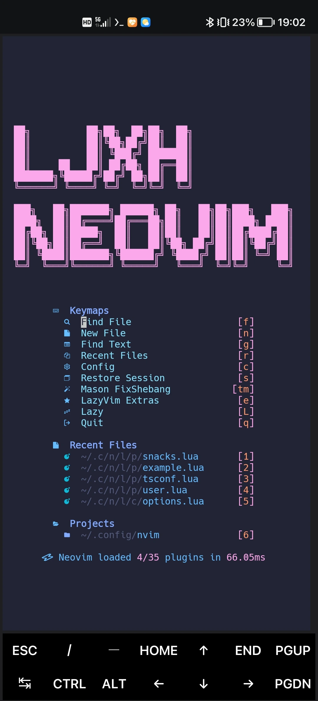
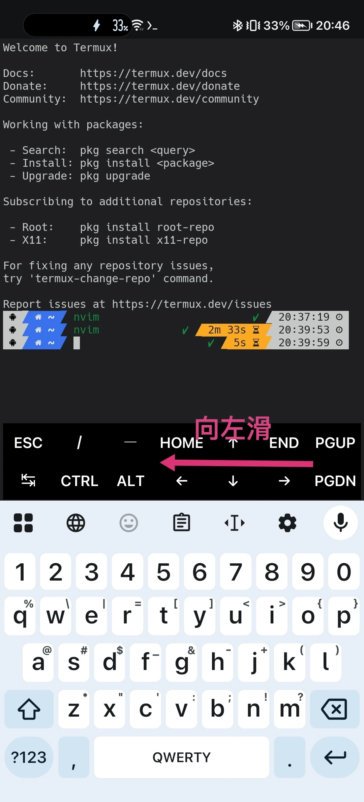

## 写在前面

之前在配置 zsh 时，我就说过要写一篇配置 Neovim 的文章。今天，我就在这里说一下怎么在 Termux 中配置 Neovim。

## 碎碎念


这里可以跳过


我与 Neovim 结缘，还得感谢 VSCode。当时我刚开始写代码用的是简陋的 IDLE。简陋其实有简陋的好，能让初学者快速熟悉 Python 的基础语法，学会自己排查错误。但是 IDLE 实在是太简陋了，写起代码非常费劲。其实当时也只会写 100 行以内的简单代码，谈不上是什么大项目。

于是我便去寻找更好用的编辑器。PyCharm 固然很好，但是作为 IDE，对于我这种写简单 demo 的人来说，有点太重了。VSCode 显然更符合我的需求（其实 VSCode 用来写前端比较多）。丰富的插件市场让 VSCode 基本上是全能的。

在安装插件时，我在热门插件列表看到了一个东西：VSCodeVim。

我点开 VSCodeVim 的插件详情：

> VSCodeVim is a Vim emulator for Visual Studio Code.

这个插件是用来在 VSCode 上模拟 Vim 的操作环境的。

Vim 是什么？我去搜了一下。

> Vim is a greatly improved version of the good old UNIX editor Vi. Many new features have been added: multi-level undo, syntax highlighting, command line history, on-line help, spell checking, filename completion, block operations, script language, etc. 

看起来很厉害。好奇的我于是把插件下载了下来，看看 Vim 到底是何方神圣。

为什么我输入不了东西？为什么光标飞来飞去？为什么用不了 Ctrl + V？我又去搜了下使用方法。

怎么这么多模式啊，怎么这么多快捷键啊，怎么还要输入命令啊！

太反人类了！我立马将插件卸载掉。我很久都没有再碰过 Vim。

后来开始折腾 Linux 虚拟机。用 Nano 编辑配置文件真是太麻烦了！（就像用记事本编辑 Windows 的配置文件）于是我便去找 Linux 上轻量又好用的文本编辑器。

自然，我又看见了 Vim。为什么这么多大佬都用 Vim？难道 Vim 真的很好用吗？反正 Linux 终端文本编辑器只有这些，试一下吧。

认真看了一篇 Vim 的使用教程后，我知道了 Vim 的基础使用方法。

不用鼠标真是太爽了！发明 Vim 的人真是天才！

后来，我开始在安卓手机上折腾 Termux。Termux 是一个终端模拟器，自然也支持 Vim。不过，Vim 有点太古老了，Neovim 是更好的选择。

说的有点多了，下面开始在 Termux 下配置 Neovim。

## 效果图



## 配置方法

### 1. 安装 Neovim

这里没什么好说的，直接 pkg 安装即可。

``` Shell
pkg i neovim
```

### 2. 对于 Termux 的前置准备

如果你想自己折腾，可以编辑 Neovim 的配置文件。这里不再赘述。需要的可以自行查询其他教程。

LazyVim 官方教程已经很详细了，如果需要更多支持，建议查询官方教程：



如果用的是普通手机（遥控器比例），官方 LazyVim 可能适配的不是很好，我找到了为 Termux 定制的 LazyVim，我在这里会用该 LazyVim 的脚本来配置。




该仓库为第三方仓库，如果已经停更，建议换用官方仓库


先安装需要的包：

``` Shell
apt update && apt upgrade
apt install termux-api python neovim git nodejs-lts
apt install termux-tools lazygit ripgrep
apt install ruff luarocks lua-language-server clang
```

要安装 Termux:API 以便让功能更完备。





### 3. 安装 LazyVim

在安装 LazyVim 之前，先备份配置文件。（当然，如果你什么都没做，Termux 提示文件不存在，那么可以跳过备份）

``` Shell
mv ~/.config/nvim ~/.config/nvim.bak
```

接着就是安装 LazyVim 了！


接下来会使用 GitHub，由于 GitHub 服务器在国外，接下来的几步可能需要代理，最好在结束之前都不要关。


克隆 LazyVim 仓库

``` Shell
git clone https://github.com/Veha0001/DotLazyVim ~/.config/nvim
```

输入 `nvim`，启动 Neovim。这里会有一段时间的黑屏，不用担心，稍等一下就会弹出界面进行初始化。

初始化时，LazyVim 会从 GitHub 拉取一些文件，时间可能会比较长，请坐和放宽。

如果初始化时出现错误，可以 Ctrl + C 强制退出，如果不行，尝试输入 `:q` 退出。退出后再次输入 `nvim` 重新初始化。如果还是不行，可以删除 LazyVim 和 Neovim，重头开始配置。

``` Shell
rm -rf ~/.config/nvim \
       ~/.local/share/nvim \
       ~/.local/state/nvim \
       ~/.cache/nvim
pkg uninstall neovim
```

初始化完成后，退出再进入 Neovim，Lazy Vim 就安装完成了！

### 4. 配置和美化 LazyVim（可选）

如果对 LazyVim 默认效果不满意，可以进行配置和美化。

由于配置内容过多，这里不详细讲了，具体看官方文档



这里只说一下更改欢迎页的顶部图案。

选择欢迎页的 `Config`，打开文件树的 `nvim/lua/plugins/snacks.lua`，更改顶部的 `dashboard_custom_header17` 变量，例如：

``` lua
local dashboard_custom_header17 = {
  " ",
  "██╗          ██╗██╗  ██╗██╗  ██╗                  ",
  "██║          ██║╚██╗██╔╝██║  ██║                  ",
  "██║          ██║ ╚███╔╝ ███████║                  ",
  "██║     ██   ██║ ██╔██╗ ██╔══██║                  ",
  "███████╗╚█████╔╝██╔╝ ██╗██║  ██║                  ",
  "╚══════╝ ╚════╝ ╚═╝  ╚═╝╚═╝  ╚═╝                  ",
  "                                                  ",
  "███╗   ██╗███████╗ ██████╗ ██╗   ██╗██╗███╗   ███╗",
  "████╗  ██║██╔════╝██╔═══██╗██║   ██║██║████╗ ████║",
  "██╔██╗ ██║█████╗  ██║   ██║██║   ██║██║██╔████╔██║",
  "██║╚██╗██║██╔══╝  ██║   ██║╚██╗ ██╔╝██║██║╚██╔╝██║",
  "██║ ╚████║███████╗╚██████╔╝ ╚████╔╝ ██║██║ ╚═╝ ██║",
  "╚═╝  ╚═══╝╚══════╝ ╚═════╝   ╚═══╝  ╚═╝╚═╝     ╚═╝",
  " ",
  " ",
}
```

字符画的生成可以使用这个网站，网站提供很多样式。你可以将生成的字符画发给 AI，让 AI 帮你把字符画转成这个变量的格式。



返回 NORMAL 模式，输入 `wq` 保存并退出。

再次进入 Neovim，就会发现，配置文件生效了。

## Neovim 基础使用

这里记录一下 Neovim 的基础使用方法。此处使用 DeepSeek 辅助生成。这些东西还是 AI 方便，所有键位均已验证过。

### 1. 核心模式切换
| 按键 | 模式名称 | 功能说明 |
| :--- | :--- | :--- |
| `Esc` / `Ctrl` `[` | 普通模式 (Normal) | **万能回退键**，回到普通模式执行命令 |
| `i` | 插入模式 (Insert) | 在光标**前**开始输入文字 |
| `a` | 插入模式 (Insert) | 在光标**后**开始输入文字 |
| `o` | 插入模式 (Insert) | 在光标所在行**下方**新增一行并进入插入模式 |
| `O` | 插入模式 (Insert) | 在光标所在行**上方**新增一行并进入插入模式 |
| `v` | 可视模式 (Visual) | **按字符**选择文本（用于选中后复制/删除） |
| `V` | 可视模式 (Visual) | **按整行**选择文本 |
| `Ctrl` `v` | 可视块模式 (Visual Block) | **按矩形块**选择文本（多列编辑神器） |

### 2. 光标移动（普通模式下）
| 按键 | 功能说明 |
| :--- | :--- |
| `h` / `j` / `k` / `l` | **左** / **下** / **上** / **右** 移动（远离方向键，保护手腕） |
| `w` / `b` | 按**单词**向前跳 / 向后跳 |
| `0` (数字零) | 跳到当前行的**行首** |
| `$` | 跳到当前行的**行尾** |
| `gg` | 跳到文件的**第一行** |
| `G` | 跳到文件的**最后一行** |
| `Ctrl` `d` / `Ctrl` `u` | 向下 / 向上滚动**半页** |
| `%` | 跳转到匹配的括号 `()`、`{}`、`[]`（用于检查代码结构） |

### 3. 增删改查（编辑操作）
| 按键 | 功能说明 |
| :--- | :--- |
| `x` | 删除光标所在的**单个字符** |
| `dd` | **剪切**（删除）当前光标所在**整行** |
| `yy` | **复制**当前光标所在**整行** |
| `p` / `P` | 在光标**之后** / **之前**粘贴剪切板内容 |
| `u` | **撤销** (Undo) 上一次操作 |
| `Ctrl` `r` | **重做** (Redo) 刚才撤销的操作 |
| `.` | **重复**上一次的修改操作（效率极高，多用） |

### 4. 文件与缓冲区操作（需按 `:` 进入命令模式）
| 命令 | 功能说明 |
| :--- | :--- |
| `:w` | **保存**当前文件 (Write) |
| `:q` | **退出** Neovim（仅当文件未修改时） |
| `:wq` 或 `:x` | **保存并退出** |
| `:q!` | **强制退出**（放弃所有未保存的修改） |
| `:e 文件名` | 在当前窗口打开/切换指定文件 (Edit) |
| `:bd` | **关闭**当前缓冲区（关闭当前编辑的文件，不退出程序） |

### 5. 搜索与替换
| 按键 / 命令 | 功能说明 |
| :--- | :--- |
| `/关键词` | 在当前文件中**向下**搜索关键词 |
| `?关键词` | 在当前文件中**向上**搜索关键词 |
| `n` / `N` | 跳转到**下一个** / **上一个**搜索匹配项 |
| `:%s/旧词/新词/g` | 将全文件中所有 `旧词` **替换**为 `新词` |
| `:%s/旧词/新词/gc` | 全文件替换，但每次替换前都会问你是否**确认** (Confirm) |

### 6. LazyVim 常用快捷键（默认 Leader 键 = 空格键）
| 快捷键 | 功能说明 |
| :--- | :--- |
| `Space` | 即 Leader 键，几乎所有自定义快捷键的前缀 |
| `Space` `e` | 打开/关闭文件树 (Neo-tree) |
| `Space` `f` `f` | 查找项目文件 (Find Files) |
| `Space` `s` `g` | 全局文本搜索 (Live Grep，类似 VSCode 的全局搜索) |
| `Space` `w` `w` | 保存当前文件 (Write) |
| `Space` `q` `q` | 退出 Neovim (Quit) |
| `Space` `x` `x` | 打开当前文件的错误诊断列表 (Trouble) |
| `Space` `/` | 高亮搜索当前文件（并实时预览） |

## 小技巧

如果用的是 Gboard，Termux 会将 Gboard 锁定为英文键盘，无法输入中文。

但是，如果向左滑动 Termux 的小键盘，小键盘就会变成输入框，现在就可以输入中文了，按回车即可将中文从输入框输入到命令行。



另外，在左侧屏幕边缘向右滑动，可以滑出 Termux 侧边栏，可以添加新 session。

Termux 也真是的，把这些东西藏这么深，也不做个引导。

## 结尾

Neovim 真的是很好的工具，虽然比较难，但是用熟了之后，绝对会让效率提升很多。

不过，如果有电脑，还是在电脑用 Neovim 比较好一点。

理论上，这篇文章对于 Linux 也通用，只要将 `pkg install` 换成对应的包管理器，将 LazyVim 换成官方版本就可以了。

就说这么多，进阶配置可以看 Neovim 和 LazyVim 官方文档，很详细了，这篇文章用来记录和备忘。