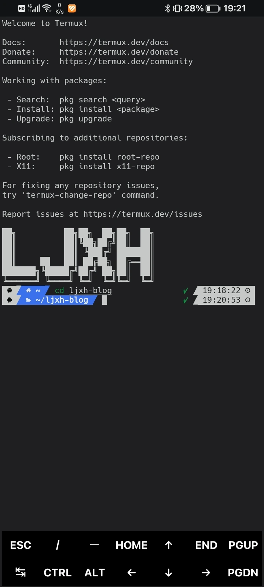

## 写在前面

众所周知，Termux 是安卓手机上最好用的终端模拟器之一。我这个博客在写代码时就是用 Termux 预览的。~~也就只有我这种人会用手机写代码了（笑）~~

但是，Termux 默认样式太丑了，还没有自动补全，有点麻烦。还是把 shell 换成 zsh 方便点，顺便安装 Oh My Zsh，好好美化一下。

这篇文章用作备忘，参考



## 效果图



## 配置方法


配置方法可能因软件更新而不同，请注意检查版本号。


开发环境：

- Termux 0.118.3
- zsh 5.9.1 (aarch64-unknown-linux-android)
- Oh My Zsh version master (e1d1f0d)

你需要准备：

- 可以上网和运行终端的安卓设备
- 脑子
- 手

让我们开始吧。

### 1. 安装 zsh

安装 zsh 十分简单，直接

``` Shell
pkg install zsh
```

即可。如果下载时间过久，使用 `termux-change-repo` 切换仓库镜像。在弹出的页面选择 `Mirror group`，再选择 `Mirrors in Chinese`。

### 2. 安装 Oh My Zsh

输入

``` Shell
sh -c "$(curl -fsSL https://raw.githubusercontent.com/ohmyzsh/ohmyzsh/master/tools/install.sh)"
```

由于 GitHub 服务器在国外，访问速度慢，可能需要使用代理。后面也会使用到 GitHub，注意网络环境。

安装时会询问 `Do you want to change your default shell to zsh?`，直接按  即可。

### 3. 安装 Powerlevel10k 主题

输入



<!-- tab GitHub -->

``` Shell
git clone --depth=1 [https://github.com/romkatv/powerlevel10k.git](https://link.zhihu.com/?target=https%3A//github.com/romkatv/powerlevel10k.git) "${ZSH_CUSTOM:-$HOME/.oh-my-zsh/custom}/themes/powerlevel10k"
```

<!-- endtab -->

<!-- tab Gitee -->

``` Shell
git clone --depth=1 https://gitee.com/romkatv/powerlevel10k.git "${ZSH_CUSTOM:-$HOME/.oh-my-zsh/custom}/themes/powerlevel10k"
```

<!-- endtab -->



中国大陆建议使用 Gitee 源。

### 4. 安装插件

最好在配置之前先安装插件。

推荐几个我用的插件：

#### - zsh-autosuggestions

能够提供输入建议，在输入时有灰色建议，按向右箭头即可补全。

安装方式：

``` Shell
git clone https://github.com/zsh-users/zsh-autosuggestions ${ZSH_CUSTOM:-${ZSH:-~/.oh-my-zsh}/custom}/plugins/zsh-autosuggestions
```

#### - zsh-syntax-highlighting

用来语法高亮，如果命令拼写错，会显示为红色。

安装方式：

``` Shell
git clone https://github.com/zsh-users/zsh-syntax-highlighting.git ${ZSH_CUSTOM:-${ZSH:-~/.oh-my-zsh}/custom}/plugins/zsh-syntax-highlighting
```

#### - zsh-completions

按 ，可以显示子命令列表，快速补全你要的子命令。

安装方式：

``` Shell
git clone https://github.com/zsh-users/zsh-completions.git ${ZSH_CUSTOM:-${ZSH:-~/.oh-my-zsh}/custom}/plugins/zsh-completions
```

## 5. 配置

Zsh 的配置文件是 `home` 目录下的 `.zshrc` 文件。打开这个文件。

这里说一下打开 Termux 的 `home` 目录文件的方法：

- 使用命令行文本编辑器：我常用 Nano 和 Neovim。
- 使用 MT管理器：打开 MT管理器侧边栏，点击侧边栏右上角三个点，可以添加本地存储。点击后会弹出安卓文件管理器，选择侧边栏中的 Termux 即可。

找到 `ZSH_THEME` 变量，改为：

```
ZSH_THEME="powerlevel10k/powerlevel10k"
```

找到 `plugins` 变量，这里是 zsh 的插件配置，安装了插件后要在这里启用。将已安装的插件填进去，每个插件一行，或者使用空格隔开，像这样：

```
plugins=(
  git
  sudo
  zsh-autosuggestions
  zsh-syntax-highlighting
  zsh-completions
)
```

`git` 和 `sudo` 是 zsh 自带的，可以不用安装

配置完后，使用 `zsh ~/.zshrc` 或者直接重启 Termux 使配置生效。

### 6. 设置 Termux 字体与颜色

由于 powerlevel10k 主题使用的图标依赖字体，这里在配置主题前先设置 Termux 的字体。

替换 Termux 的字体过于麻烦，建议安装 Termux:Styling 插件。

你还记得你的 Termux 是在哪里下载的吗？如果是在 GitHub 下载的，那么插件也要在 GitHub 下载；F-Droid 同理；如果是在 Google Play 下的，那你还是换回前面两个渠道下载好一点，不是不能用，而是版本可能比较旧，安装一些包会有问题。

给出下载链接：





安装好后，打开 Termux，长按任意一条输出，点击 `MORE`，选择 `Style`，点击 `CHOOSE FONT` 或 `CHOOSE COLOR` 就可以更改字体和颜色了。

我建议使用列表中的 Hack 字体，这个字体基本上有主题需要的所有图标，看着也很舒服。

配色我比较喜欢 `Base 16 Google Dark`。

这些看个人喜好，自己喜欢的就可以。

### 7. 配置 powerlevel10k 主题

输入

``` Shell
p10k configure
```

就会进入配置页面。

第一个是否安装字体选择 n 即可，因为已经设置了支持 powerlevel10k 主题需要用的图标的字体。选择图标数量那里，建议选择 `Many icons`，不然就跟普通主题没啥区别了，当然你想简洁一点也可以。其他配置看个人喜好。

配置完成后，就可以了。你也可以输入 `p10k configure` 重新配置。

## 结尾

这篇文章写了 Termux 配置 zsh 和 powerlevel10k 主题的方式。Termux 现在好看多了。

说到 Termux，以后我打算写写 Neovim 的安装和懒人配置方式。