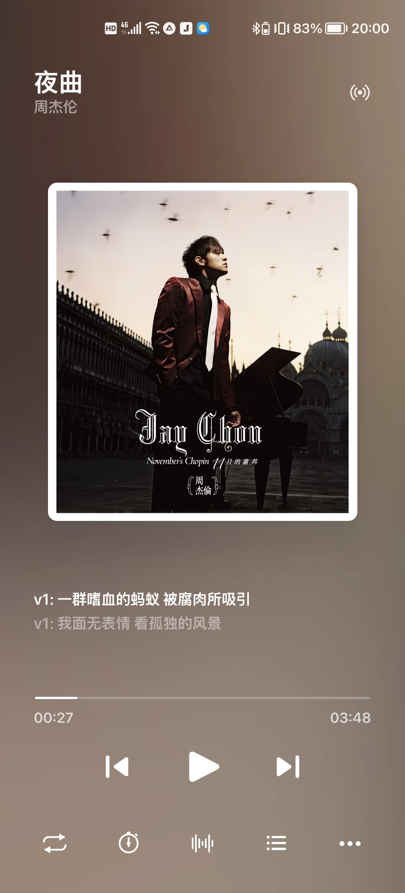
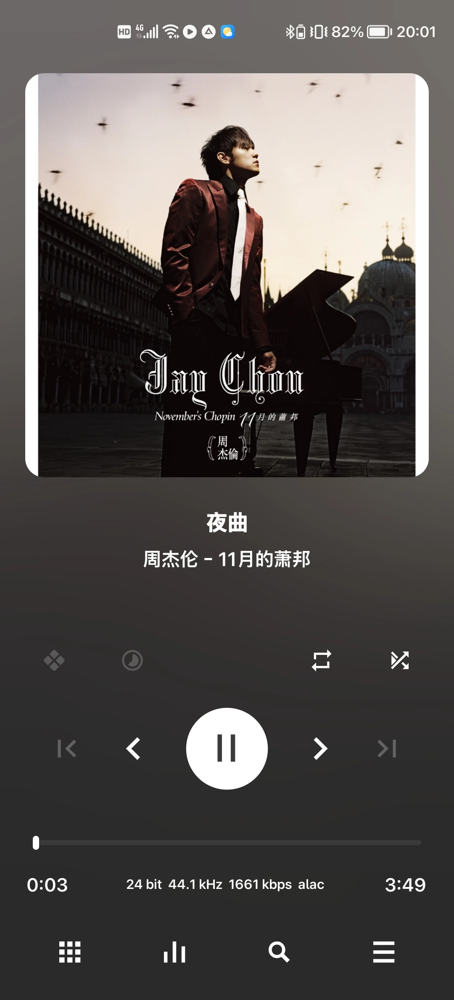
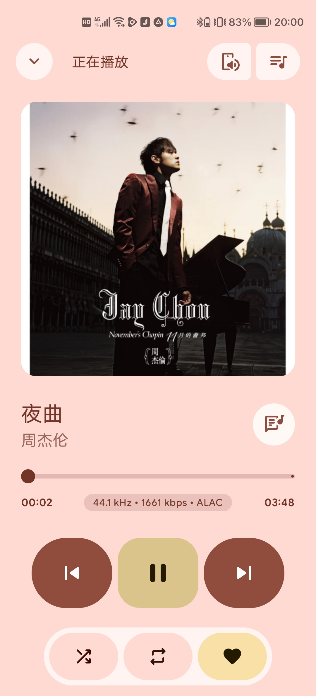
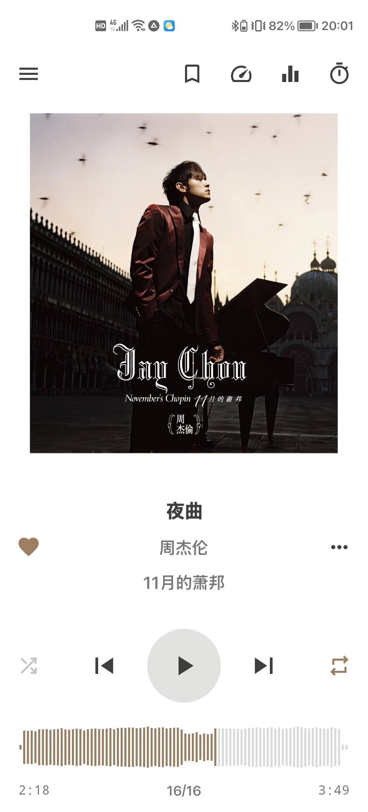
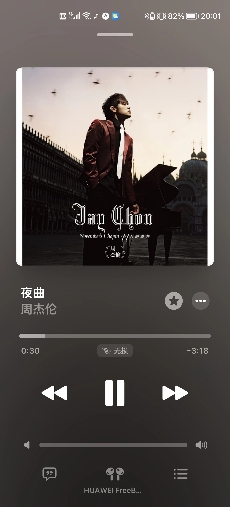

## 碎碎念

随着网络的发展，许多流媒体音乐软件出现了。国内有 QQ 音乐、网易云音乐，国外有 Spotify、Apple Music。不可否认，它们让我们听歌方便了许多。

但是，不知道从什么时候起，我听歌变成了把手机装上稳定器，接上鼠标，打开软件，卡顿几秒钟，小心翼翼地点掉广告，打开搜索，在各种各样的 DJ 版、深情版中找到我真正想要的版本，点击歌曲，发现要开会员，忍痛付费，发现不是最高音质，再开个更高级的会员，却发现是假无损，还是有沙沙声。

过了一会，想听另一首歌，去搜索，只看到“该歌曲暂无版权”，只好退出软件，打开另一个软件，重复上面的操作，还是假无损。

花了双倍的价钱，搞到的却是一半的质量。这谁受得了？

后来也发现了国外的音乐软件，那好很多，但是 Spotify 不能在中国直接用，Apple Music 虽然音质好，软件纯净，但是曲库偏少。不过如果只听主流歌手或者欧美歌曲，Apple Music 也够用了。

受不了的我只好转到本地音乐。

本地音乐真是好太多了！

## 本地音乐

本地音乐到底有什么好？

简单地说，就是有流媒体音乐没有的优点。

纯净的体验、极高的音质、不用担心的流量，让人真正地投入到音乐中。

虽说下载新歌比较麻烦，但一劳永逸，下载后想听多少遍都可以，直到听腻。

下面是我推荐的安卓听歌软件。

## 软件

### Salt Player

Salt Player 是很好用的播放器，颜值高，功能比较多，而且在最近的版本支持了 USB 独占，非常推荐。



### Poweramp

Poweramp 很有名，挺专业的，界面比较硬核，音质也挺好，自定义功能多，适合喜欢折腾的。


### PixelPlayer

Material 3 风格，好看，功能比较多。



### AIMP

很不错的播放器，界面也比较硬核，功能多。



### Flamingo

仿 Apple Music 的播放器，歌词效果非常好看。未正式发布，安装包难找一点，不过可以在作者的 Bilibili 或者 Telegram 频道上面找到。



## 结尾

想纯粹地听歌？本地音乐可能是最好的选择之一。

~~感觉这篇文章挺水的~~如果我发现了什么好歌，也会分享给大家，欢迎一起听歌。