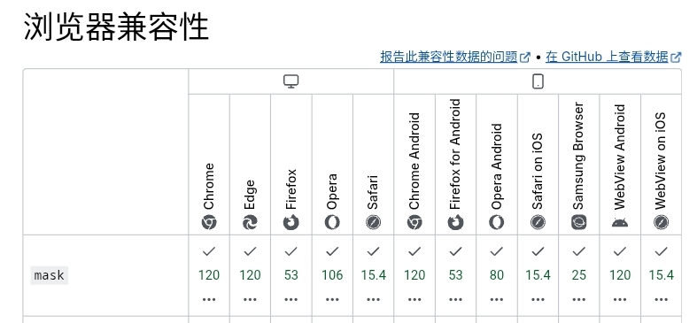

## 渐进式模糊

### 简单 CSS 实现

IOS 26 更新了液态玻璃效果，在一些顶部按钮栏，为了可读性，会出现渐进式模糊效果，其实就是最下面模糊半径为 0，越往上模糊半径越大。

CSS 本身并不支持这样的实现，但要接近这种效果，思路也很简单：

先加一个 `backdrop-filter: blur()`，再使用 `mask`，让遮罩从不透明渐变到半透明就可以了。

``` CSS
backdrop-filter: blur(2px);              /* 对背后的内容做模糊 */
-webkit-mask: linear-gradient(180deg, 
      #000 0%, 
      rgba(0,0,0,0.9) 50%, 
      transparent 100%
);
mask: linear-gradient(180deg, 
      #000 0%, 
      rgba(0,0,0,0.9) 50%, 
      transparent 100%
  );
```

这里加了 `-webkit-`，是因为 `mask` 属性在 Chrome 120 才开始去除 `-webkit-` 前缀，虽然已经基线广泛可用，但是大量老设备的 WebView 不支持



当然，要想用的话，`mask` 还是很方便的。实现效果如下图：


这里我专门为我的网站稍微做了下修改，不过大体实现效果是差不多的。

可以看到，这个方法也有些不足：在半透明的区域，会出现文字又清晰又模糊的情况。这个在现在的 CSS 上暂时无解。不过一般来说已经够用了，用户也不会特别关注。

### 使用第三方库

要是比较懒，可以使用第三方库 ABlur。



使用很简单，CDN 引入即可。

``` html
<head>
    <script src="https://unpkg.com/ablur@latest/dist/index.js"></script>
</head>
<body>
<ablur-layer>
    <span>ABlur Layer</span>
</ablur-layer>
</body>
```

效果如下：


ABlur 的好处就是它使用了多个不同半径的模糊，更还原渐进式模糊的模糊半径由 0 逐渐变大。只需要一个组件，配置几个参数就行，方便一些。不过如果 `layer` 数过多，性能会很差。

### 用 Canvas、WebGL、WebGPU 实现的思路

为了一个遮罩而使用 WebGPU 这类 API 有点没必要，就像拿大炮轰蚊子一样。不过，要是项目本来就是用 WebGPU 这类 API，或者想追求极致视觉效果的，可以参考一下这个思路：